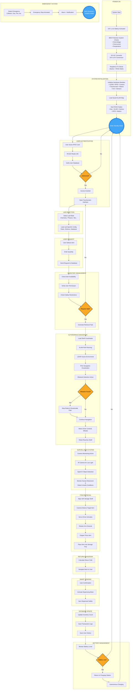

```mermaid
flowchart TD
    %% POWER ON
    subgraph PO [POWER ON]
        Start([System Start]) --> B1[24V Li-ion Battery Activated]
B1 --> B2[BMS Protection System Checks<br/>• Overvoltage<br/>• Overcurrent<br/>• Temperature]
B2 --> B3[DC-DC Converter<br/>24V to 5V Conversion]
B3 --> B4[Raspberry Pi 4 Boots<br/>Ubuntu + ROS2 Starts]
end

    %% SYSTEM INITIALIZATION
    subgraph SI [SYSTEM INITIALIZATION]
        B4 --> S1[Initialize Hardware Modules<br/>• LiDAR • RFID • Camera<br/>• Touchscreen • Motors<br/>• Arm • Sensors]
        S1 --> S2[Load Saved SLAM Map]
        S2 --> S3[Start ROS2 Nodes<br/>• Nav • SLAM • Camera<br/>• RFID • Motors]
        S3 --> S4(((Enter Standby Mode)))
    end

    %% USER AUTHENTICATION
    subgraph UA [USER AUTHENTICATION]
        S4 --> U1[User Scans RFID Card]
        U1 --> U2[RC522 Reads UID]
        U2 --> U3[Verify User Database]
        U3 --> U4{Authorized?}
        U4 -- No --> S4
        U4 -- Yes --> U5[Access Granted]
        U5 --> U6[Open Touchscreen Interface]
    end

    %% LAB SELECTION
    subgraph LS [LAB SELECTION]
        U6 --> L1[Select Lab Mode<br/>Chemistry / Physics / Bio...]
        L1 --> L2[Load Lab-Specific Config<br/>Rules, Shelves, Database]
    end

    %% USER REQUEST
    subgraph UR [USER REQUEST]
        L2 --> R1[User Selects Item]
        R1 --> R2[Enter Quantity]
        R2 --> R3[Send Request to Database]
    end

    %% INVENTORY MANAGEMENT
    subgraph IM [INVENTORY MANAGEMENT]
        R3 --> I1[Check Item Availability]
        I1 --> I2[Verify User Permission]
        I2 --> I3[Check Safety Restrictions]
        I3 --> I4{Request Valid?}
        I4 -- No --> U6
        I4 -- Yes --> I5[Generate Retrieval Task]
    end

    %% AUTONOMOUS NAVIGATION
    subgraph AN [AUTONOMOUS NAVIGATION]
        I5 --> N1[Load Shelf Coordinates]
        N1 --> N2[SLAM Path Planning]
        N2 --> N3[LiDAR Scans Environment]
        N3 --> N4[RViz Navigation Visualization]
        N4 --> N5[Obstacle Detection Active]

        N5 --> N6{Obstacle Found?}
        N6 -- Yes --> N7[Stop Robot & Recalculate Path]
        N7 --> N8[Continue Navigation]
        N6 -- No --> N8

        N8 --> N9[Motor Driver Controls Wheels]
        N9 --> N10[Robot Reaches Shelf]
    end

    %% SURVEILLANCE SYSTEM
    subgraph SS [SURVEILLANCE SYSTEM]
        N10 --> V1[Camera Monitoring Active]
        V1 --> V2[IR Camera for Low Light]
        V2 --> V3[OpenCV Object Detection]
        V3 --> V4[Monitor Human Movement &<br/>Detect Unsafe Conditions]
    end

    %% ITEM RETRIEVAL
    subgraph IR [ITEM RETRIEVAL]
        V4 --> T1[Align with Storage Shelf]
        T1 --> T2[Camera Detects Target Item]
        T2 --> T3[Servo Driver Activates]
        T3 --> T4[Robotic Arm Extends]
        T4 --> T5[Gripper Picks Item]
        T5 --> T6[Place Item into Storage Tray]
    end

    %% RETURN NAVIGATION
    subgraph RN [RETURN NAVIGATION]
        T6 --> M1[Calculate Return Path]
        M1 --> M2[Navigate Back to User]
    end

    %% SMART VENDING
    subgraph SV [SMART VENDING]
        M2 --> D1[User Confirmation]
        D1 --> D2[Activate Dispensing Motor]
        D2 --> D3[Item Dispensed Safely]
    end

    %% DATABASE UPDATE
    subgraph DU [DATABASE UPDATE]
        D3 --> DB1[Update Inventory Count]
        DB1 --> DB2[Save Transaction Logs]
        DB2 --> DB3[Save User History]
    end

    %% BATTERY MANAGEMENT
    subgraph BM [BATTERY MANAGEMENT]
        DB3 --> C1[Monitor Battery Level]
        C1 --> C2{Battery Low?}
        C2 -- No --> S4
        C2 -- Yes --> C3[Return to Charging Station]
        C3 --> C4[Autonomous Charging]
        C4 --> S4
    end

    %% EMERGENCY SYSTEM (Parallel/Interrupt)
    subgraph ES [EMERGENCY SYSTEM]
        E1[Detect Emergency<br/>Collision, Gas, Fire, etc.] --> E2[Emergency Stop Activated]
        E2 --> E3[Alarm + Notification]
        E3 --> E4(((Safe Shutdown /<br/>Isolation Mode)))
    end

    %% Styling
    classDef decision fill:#f9a826,stroke:#333,stroke-width:2px,color:#000;
    classDef state fill:#42a5f5,stroke:#1565c0,stroke-width:2px,color:#fff;
    class U4,I4,N6,C2 decision;
    class S4,E4 state;
```
